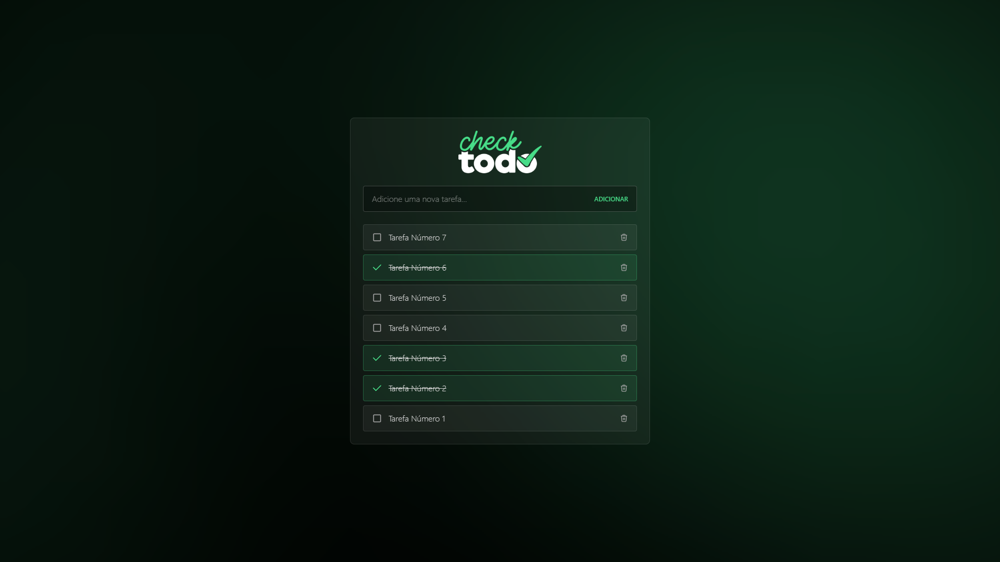

<h1 align="center">check-todo</h1>

<p align="center">
  <a href="#-configuração-do-projeto">Configuração do projeto</a> •
  <a href="#-tecnologias">Tecnologias</a> •
  <a href="#-licença">Licença</a>
</p>

Um projeto de lista de tarefas usando a API REST do [json-server](https://www.npmjs.com/package/json-server) usando um arquivo json para salvar os dados.



# 💻 Configuração do projeto

### Simular uma API REST

```sh
npx json-server api/database.json
```

### Compilar e recarregar para desenvolvimento

```sh
npm run dev
```

### Compilar e otimizar para produção

```sh
npm run build
```

# 🚀 Tecnologias

-   [VueJS](https://vuejs.org)
-   [TailwindCSS](https://tailwindcss.com)
-   [json-server](https://www.npmjs.com/package/json-server)

## 📝 License

Este projeto está licenciado sob a licença MIT.
